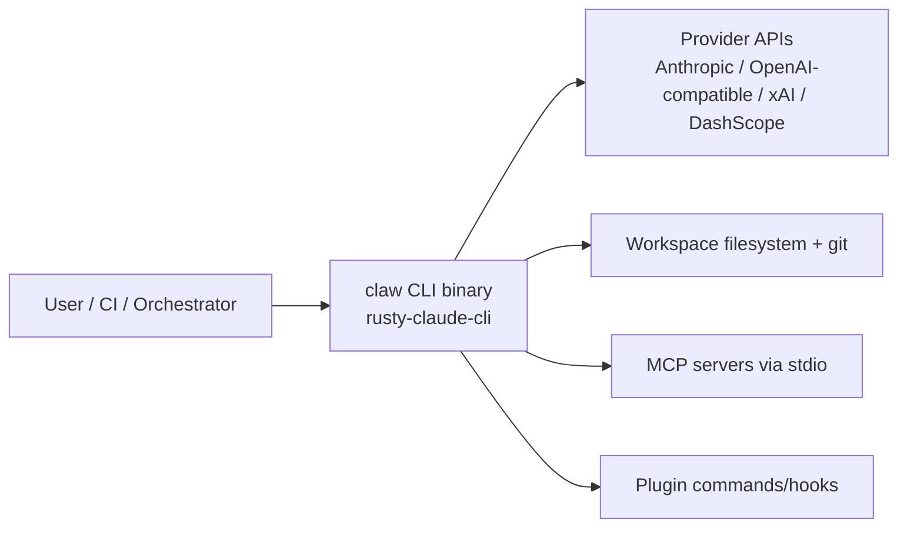
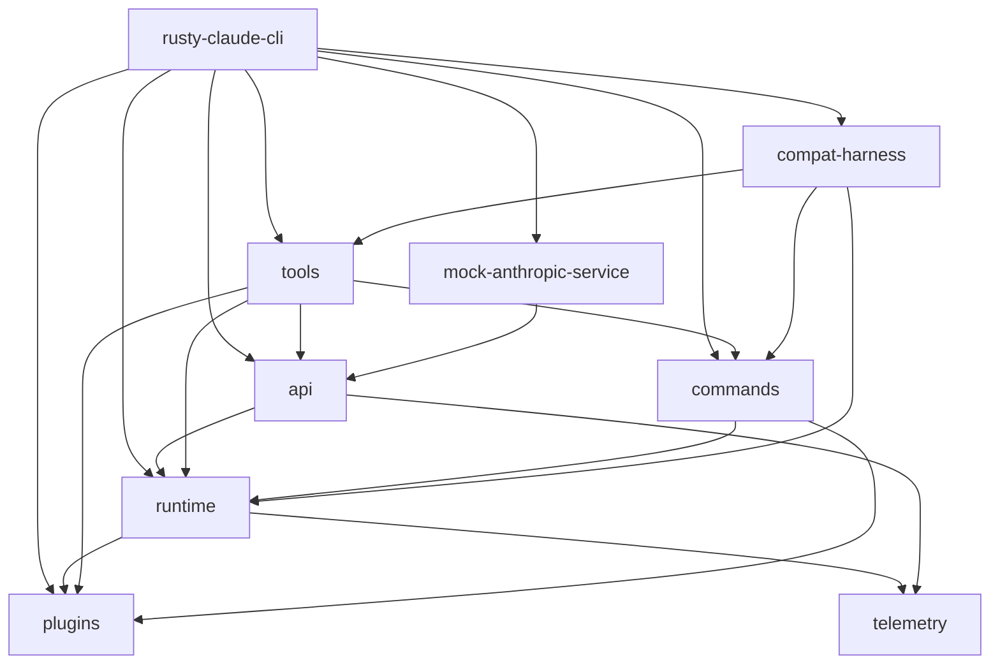
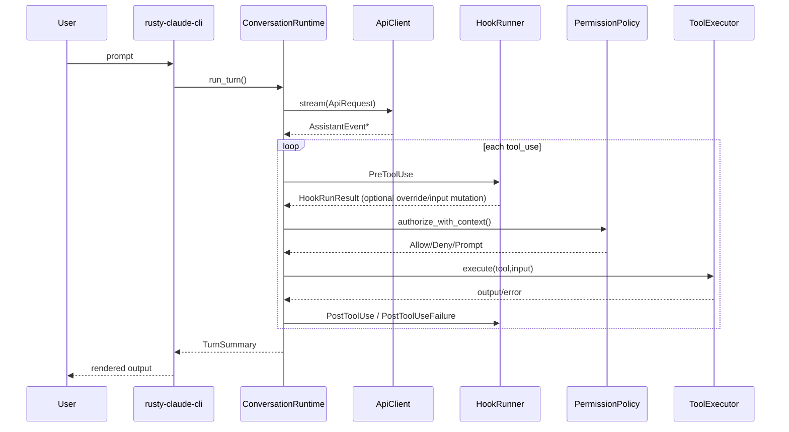

# Project Architecture Blueprint (Rust workspace)

> **Generated:** 2026-04-13T02:20:48Z  
> **Scope:** `./rust`  
> **Commit baseline:** `5e6a251`  
> **Architecture style:** Layered modular monolith with registry/plugin extensions
> **Note:** Codex 5.3 not able to follow the instructions about the archtiecture blueprint file name as `architecture-blueprint-{YYYY-MM-DD-HH-MM-SS.sss}-{mode-name}.md` given in claw-code-arch-blueprint custom agent 

---

## 1. Architecture detection and analysis

This codebase is a Rust Cargo workspace (`rust/Cargo.toml`) with **9 crates** under `rust/crates/*`. It is a CLI-centric runtime (no web framework) built around:

- **Core runtime orchestration:** `runtime` crate
- **Provider abstraction:** `api` crate (Anthropic + OpenAI-compatible transports)
- **Tooling/control plane:** `tools`, `commands`, `plugins`
- **Entrypoint and UX shell:** `rusty-claude-cli`
- **Observability + compatibility/test harnesses:** `telemetry`, `compat-harness`, `mock-anthropic-service`

Detected primary patterns:

1. **Layered architecture** (CLI entry → runtime orchestration → provider/tool integrations → infra primitives).
2. **Trait-based runtime boundaries** (`ApiClient`, `ToolExecutor`, `PermissionPrompter`) enabling pluggable implementations.
3. **Registry-driven extensibility** (`GlobalToolRegistry`, plugin registry, MCP manager, task/team/worker registries).
4. **State-machine flavored control-plane modules** (worker/lane/policy/recovery/stale-branch/green-contract).

The workspace enforces `unsafe_code = "forbid"` and pedantic clippy at workspace level.

---

## 2. Architectural overview

At runtime, `rusty-claude-cli` builds a `ConversationRuntime<AnthropicRuntimeClient, CliToolExecutor>` and drives a turn loop:

1. Persist user message into session.
2. Stream provider response (assistant text + tool calls).
3. Run hook + permission pipeline per tool call.
4. Execute tools via registry.
5. Feed tool results back into the model loop until no more `tool_use` blocks.
6. Persist usage/cache/session metadata and optionally compact.

The architecture is optimized for:

- **Safety:** permission modes, dynamic tool classification, hook-mediated overrides.
- **Resilience:** retries, fallback providers, MCP degraded startup reports, recovery recipes.
- **Extensibility:** plugin tools/hooks/lifecycle, MCP tool discovery, sub-agent runtimes.
- **Auditability:** structured session persistence and telemetry events.

---

## 3. Architecture visualization

### 3.1 C4 level 1 (system context)



### 3.2 C4 level 2 (container / crate map)



### 3.3 Turn execution flow (runtime sequence)



---

## 4. Core architectural components

### 4.1 Crate responsibilities

| Crate | Responsibility | Key implementation anchors |
|---|---|---|
| `rusty-claude-cli` | CLI parsing, REPL, runtime wiring, permission prompt UX, slash-command entrypoints | `main.rs::build_runtime*`, `AnthropicRuntimeClient`, `CliToolExecutor` |
| `runtime` | Conversation loop, sessions, config, permission policy, hooks, MCP lifecycle types, control-plane modules | `conversation.rs`, `session.rs`, `config.rs`, `permissions.rs`, `hooks.rs` |
| `api` | Provider clients, model/provider routing, retries, SSE parsing, request preflight, prompt cache | `providers/mod.rs`, `providers/anthropic.rs`, `providers/openai_compat.rs`, `prompt_cache.rs` |
| `tools` | Built-in/runtime/plugin tool registry and dispatch, dynamic permission checks, sub-agent runtime | `tools/src/lib.rs::GlobalToolRegistry`, `execute_tool_with_enforcer`, `ProviderRuntimeClient` |
| `plugins` | Plugin discovery, install/enable/update, hook aggregation, lifecycle commands, manifest validation | `plugins/src/lib.rs::PluginManager`, `detect_claude_code_manifest_contract_gaps` |
| `commands` | Slash command specs + parsing/rendering helpers | `commands/src/lib.rs::SLASH_COMMAND_SPECS` |
| `telemetry` | Session tracer, HTTP/analytics/session events, JSONL sink | `telemetry/src/lib.rs::SessionTracer` |
| `compat-harness` | Extracts upstream manifest surfaces for parity checks | `compat-harness/src/lib.rs::extract_manifest` |
| `mock-anthropic-service` | Deterministic local Anthropic-compatible mock for parity tests | `mock-anthropic-service/src/lib.rs::MockAnthropicService` |

### 4.2 Runtime assembly boundary

`rusty-claude-cli::build_runtime_with_plugin_state` composes:

- `ConversationRuntime`
- provider runtime client (`AnthropicRuntimeClient` wrapper around `api::ProviderClient`)
- `CliToolExecutor`
- permission policy (tool requirements + config rules)
- plugin registry lifecycle (`initialize`/`shutdown`)
- optional MCP state and runtime tools.

---

## 5. Architectural layers and dependencies

### 5.1 Implemented layer model

1. **Presentation / shell:** `rusty-claude-cli`, `commands`
2. **Application orchestration:** `runtime::conversation`, `tools` dispatcher
3. **Integration adapters:** `api` providers, MCP manager, plugin command/hook runners
4. **Infrastructure primitives:** session/config/telemetry/sandbox/validation modules

### 5.2 Dependency rules (actual workspace edges)

- `telemetry` and `plugins` are leaves.
- `runtime` depends on `plugins` + `telemetry` but not on CLI.
- `api` depends on `runtime` types + `telemetry`.
- `tools` bridges `api` + `runtime` + `commands` + `plugins`.
- `rusty-claude-cli` is top-level composition root.

No workspace circular dependency is present in crate-level edges.

### 5.3 Separation mechanisms

- **Traits:** `ApiClient`, `ToolExecutor`, `PermissionPrompter`.
- **Typed policies:** `PermissionPolicy` + `PermissionEnforcer`.
- **Config extraction layer:** `RuntimeFeatureConfig` parsed from merged JSON settings.
- **Registry surfaces:** tools/plugins/MCP/task/team/worker registries isolate extension plumbing.

---

## 6. Data architecture

### 6.1 Conversation/session model

Core persisted model in `runtime::session`:

- `Session` (version, ids, timestamps, messages, compaction metadata, fork metadata, workspace root, model, prompt history)
- `ConversationMessage` (`role`, `blocks`, optional usage)
- `ContentBlock` (`Text`, `ToolUse`, `ToolResult`)

Persistence format:

- JSONL snapshot + incremental append records (`session_meta`, `message`, `compaction`, `prompt_history`)
- atomic writes
- rotation at `256 KiB` with capped rotated logs.

### 6.2 Configuration model

`ConfigLoader` merges settings with precedence:

`User` → `Project` → `Local`

Feature extraction outputs `RuntimeFeatureConfig` for:

- hooks, plugins, MCP server map, oauth, model aliases, permission mode/rules, sandbox, provider fallbacks, trusted roots.

Validation (`config_validate.rs`) emits:

- unknown key errors with suggestions
- type mismatch errors
- deprecation warnings
- unsupported format rejection (e.g. TOML).

### 6.3 Caching data

`api::PromptCache` stores per-session state under cache paths:

- completion cache entries with TTL
- prompt fingerprint state
- cache-break detection events + stats.

---

## 7. Cross-cutting concerns implementation

### 7.1 Authentication & authorization

- Provider auth resolution from environment/OAuth token sources in `api::providers::anthropic`.
- Runtime permission checks in `PermissionPolicy::authorize_with_context`.
- Hook-provided permission override (`Allow`/`Deny`/`Ask`) integrated before final decision.
- Interactive approval path via CLI `PermissionPrompter`.
- Extra enforcement shim (`PermissionEnforcer`) used by tool runtime, including dynamic required-mode checks.

### 7.2 Error handling & resilience

- Rich `ApiError` taxonomy with retryability and safe failure classification.
- Exponential backoff + jitter in provider clients.
- Streaming failure fallback to non-stream request path in CLI provider bridge.
- Post-tool stall timeout + continuation retry in `AnthropicRuntimeClient::stream`.
- MCP manager auto-reset and retry on transport/timeout/invalid-response cases.
- Recovery recipes (`recovery_recipes.rs`) for known failure scenarios.

### 7.3 Logging, tracing, monitoring

- `SessionTracer` emits structured events for turn/tool/http lifecycle.
- `JsonlTelemetrySink` persists telemetry records.
- Worker control-plane state exported to `.claw/worker-state.json`.

### 7.4 Validation

- Config schema/type/key validation.
- Plugin manifest and path validation, including explicit contract-gap checks.
- Bash validation module classifies command intent and destructive/read-only constraints.
- Session load format guards and workspace-root mismatch checks.

### 7.5 Configuration management

- Multi-file discovery (`.claw.json`, `.claw/settings.json`, local overrides).
- Deep merge semantics across scopes.
- Typed parsing with explicit parse errors (no broad silent fallback).

---

## 8. Service communication patterns

### 8.1 Provider communication

- **Protocol:** HTTP JSON + SSE streams.
- **Anthropic:** `/v1/messages` + `/v1/messages/count_tokens`.
- **OpenAI-compatible:** `/chat/completions` request/stream translation.
- **Routing:** model-prefix-first, then env-inferred fallback (`providers/mod.rs`).

### 8.2 Runtime ↔ tool communication

- In-process dispatch by tool name with JSON input schema per tool spec.
- Tool results normalized into `ConversationMessage::ToolResult`.
- Hook payloads passed via env vars + JSON stdin to shell subprocesses.

### 8.3 MCP communication

- JSON-RPC over **stdio** via spawned subprocesses.
- Managed discovery/indexing of qualified tool names.
- Resource listing/reading and tool invocation with timeout wrappers.
- Degraded startup reports for partial connectivity.

### 8.4 Plugin communication

- Plugin tools and hook command execution via subprocess.
- Plugin lifecycle phases: `Init` and `Shutdown` command lists.
- Registry aggregates hook/tool contributions for runtime composition.

---

## 9. Rust-specific architectural patterns

### 9.1 Crate organization approach

- Workspace crates map to cohesive domains (runtime, api, tools, plugins, etc.).
- `rusty-claude-cli` remains the only binary composition root.
- Support crates isolate parity/mocking concerns from production runtime.

### 9.2 Memory and performance patterns

- No unsafe code in workspace policy.
- Ownership/clone boundaries are explicit in stream assembly and session persistence.
- Global registries use `OnceLock` for process-wide tool/task/team/worker registries.

### 9.3 Async programming approach

- Provider + MCP clients use `tokio` async I/O.
- Synchronous runtime boundaries wrap async clients with local runtimes where required.
- SSE parsing implemented as incremental state machines.

---

## 10. Implementation patterns

### 10.1 Interface design patterns

- `ConversationRuntime<C, T>` is generic over API and Tool executor traits.
- CLI binds concrete implementations without leaking shell concerns into runtime core.
- Permission prompt abstraction keeps UI concerns outside policy logic.

### 10.2 Service composition patterns

- Build sequence: config → plugin registry + hooks/tools → MCP discovery → permission policy → runtime assembly.
- `BuiltRuntime` owns runtime + plugin + MCP lifecycle shutdown behavior.

### 10.3 Data access patterns

- File-backed persistence (`Session`, prompt cache, plugin registry/settings).
- Atomic writes for critical state surfaces.
- Strict parse/shape validation before accepting persisted data.

### 10.4 API/request handling patterns

- CLI normalizes user input into runtime requests.
- Provider adapters normalize provider-specific response formats into shared stream events.

---

## 11. Testing architecture

### 11.1 Test boundaries

- **Unit tests:** extensive per-crate module tests.
- **Integration/parity tests:** CLI harnesses with mock provider service.
- **Contract/parity extraction:** `compat-harness` compares surface manifests.

### 11.2 Test doubles and mocks

- `mock-anthropic-service` provides deterministic HTTP/SSE behavior for scenario-driven tests.
- In-memory executors/registries used by runtime unit tests.

### 11.3 Verification workflow (workspace)

Run from `rust/`:

```bash
cargo fmt
cargo clippy --workspace --all-targets -- -D warnings
cargo test --workspace
```

---

## 12. Deployment architecture

### 12.1 Runtime topology

- Primary deployment model is a **local CLI binary** (`claw`).
- External dependencies:
  - LLM provider APIs
  - optional MCP server subprocesses
  - local filesystem + git.

### 12.2 Environment-driven behavior

- Provider keys/base URLs from environment.
- Optional upstream proxy and remote session context from `runtime::remote`.
- Config files merged from user/project/local scopes.

### 12.3 Runtime state locations

- Sessions: `.claw/sessions/<workspace-fingerprint>/...`
- Worker state: `.claw/worker-state.json`
- Prompt cache: per-session cache directories under runtime cache root.

---

## 13. Extension and evolution patterns

### 13.1 Feature addition patterns

1. **New tool**
   - Add `ToolSpec` + execution arm in `tools/src/lib.rs`.
   - Assign required permission mode.
   - Wire into `GlobalToolRegistry` and CLI/tool search surfaces.

2. **New provider**
   - Add routing metadata in `api/providers/mod.rs`.
   - Implement provider client adapter to shared `MessageRequest/StreamEvent`.
   - Ensure preflight/retry/error semantics align with existing clients.

3. **New plugin capability**
   - Extend manifest schema and validation.
   - Update plugin registry aggregation and runtime merge points.

4. **New slash command**
   - Add `SlashCommandSpec` and parser/handler routing in CLI/commands layer.

### 13.2 Modification patterns

- Keep changes at the owning crate/layer.
- Preserve typed boundaries instead of cross-layer shortcuts.
- Update tests in crate-local tests and parity harness surfaces when behavior changes.

### 13.3 Integration patterns

- MCP server integrations use `RuntimeConfig` mcp server definitions and stdio manager.
- External systems should be adapted behind tool or provider boundaries, not directly inside `ConversationRuntime`.

---

## 14. Architectural pattern examples

### 14.1 Layer separation via trait-bound runtime

```rust
pub struct ConversationRuntime<C, T> {
    session: Session,
    api_client: C,      // trait: ApiClient
    tool_executor: T,   // trait: ToolExecutor
    permission_policy: PermissionPolicy,
    // ...
}
```

**Pattern:** runtime core owns loop/state; transport and tool execution are injected.

### 14.2 Permission + hook mediation around tool execution

```rust
let pre = self.run_pre_tool_use_hook(&tool_name, &input);
let ctx = PermissionContext::new(pre.permission_override(), pre.permission_reason().map(ToOwned::to_owned));
let decision = self.permission_policy.authorize_with_context(&tool_name, &effective_input, &ctx, prompter);
```

**Pattern:** hooks can deny, request prompt, or mutate input before execution.

### 14.3 Provider fallback chain for sub-agent runtime

```rust
for entry in chain.iter() {
    match stream_with_provider(&entry.client, &message_request).await {
        Ok(events) => return Ok(events),
        Err(err) if err.is_retryable() => continue, // fallback
        Err(err) => return Err(err),
    }
}
```

**Pattern:** retryable provider failures move to configured fallback model chain.

### 14.4 Plugin contract enforcement

`detect_claude_code_manifest_contract_gaps` rejects unsupported manifest fields (`skills`, `mcpServers`, `agents`, unsupported hook names), enforcing explicit compatibility boundaries.

---

## 15. Architectural decision records (inferred)

| ADR | Context | Decision | Consequences |
|---|---|---|---|
| ADR-01 | Need high-confidence local runtime | Use Rust workspace modular monolith | Strong type safety and performance; larger single-repo coordination cost |
| ADR-02 | Provider diversity with one runtime loop | Normalize providers behind shared message/stream types | Easy multi-provider support; adapter complexity in API crate |
| ADR-03 | Tool safety requirements | Permission modes + rules + hook overrides + interactive prompt | Strong guardrails; more execution path complexity |
| ADR-04 | Extensibility without recompiling core | Plugin + runtime tool registries | Fast extension path; contract validation required to avoid drift |
| ADR-05 | Need partial MCP startup tolerance | Best-effort MCP discovery + degraded reports | Higher availability; consumers must handle partial tool sets |
| ADR-06 | Session reliability under growth | JSONL snapshots + append + rotation + compaction | Durable local history; compaction consistency complexity |
| ADR-07 | Observability for autonomous workers | Structured lane/worker events + state file | Better automation/debuggability; extra state surfaces to maintain |
| ADR-08 | Upstream parity pressure | Dedicated compat harness + mock service | Safer migration parity; additional maintenance in test tooling |

---

## 16. Architecture governance

Consistency is maintained by:

1. **Workspace policies:** forbid unsafe code, strict clippy profiles.
2. **Schema + contract validators:** config and plugin manifest validation gates.
3. **Structured state models:** typed events and enums for worker/lane/lifecycle flows.
4. **Parity infrastructure:** mock harness and manifest extraction for behavioral/surface alignment.
5. **Layered crate ownership:** clear composition root (`rusty-claude-cli`) and domain crates.

Governance hotspots to keep stable:

- `ConversationRuntime::run_turn` semantics
- provider routing rules (`detect_provider_kind`)
- permission/hook precedence
- plugin and MCP compatibility boundaries.

---

## 17. Blueprint for new development

### 17.1 Recommended workflow by feature type

1. **Runtime behavior change**
   - Start in `runtime` (`conversation`, `permissions`, `hooks`, `session`).
   - Add/adjust trait surface only if necessary.
   - Update unit tests around turn loop and policy behavior.

2. **New provider capability**
   - Implement in `api/providers/*`.
   - Preserve shared event model.
   - Add provider-specific tests + routing coverage.

3. **New tool**
   - Add schema + execution arm in `tools`.
   - Set required permission and dynamic classification (if command-like).
   - Ensure visibility in tool search and CLI integration.

4. **New plugin/MCP feature**
   - Extend manifest/config parsing.
   - Keep explicit compatibility checks for unsupported contracts.
   - Surface degraded/failure state structurally.

### 17.2 Implementation templates

- **Tool template:** `ToolSpec` + `run_*` function + `execute_tool_with_enforcer` match arm.
- **Provider template:** request translation + stream state machine + normalized `MessageResponse`.
- **Policy template:** add enum/state in `lane_events`/`policy_engine` and keep serialized wire names stable.

### 17.3 Common pitfalls

- Bypassing `PermissionPolicy` or hook outputs in tool paths.
- Emitting incomplete assistant streams without terminal `MessageStop`.
- Introducing provider routing ambiguity by env-var-only detection.
- Forgetting workspace-root checks in session/reference handling.
- Adding plugin surface without manifest compatibility checks.

### 17.4 Keep-this-blueprint-current guidance

Update this blueprint whenever any of these change:

- crate dependency edges
- runtime turn-loop semantics
- provider routing matrix
- permission/hook precedence model
- plugin or MCP lifecycle contracts
- session persistence formats.

---

**Generated for:** Rust-based `claw-code` architecture in `./rust`  
**Update cadence recommendation:** regenerate on each significant runtime/provider/plugin/MCP refactor.

