# Claw Code — Project Architecture Blueprint

> **Generated:** 2026-04-14T16:31:01.466Z  
> **Model:** Claude Opus 4.6  
> **Repository:** ultraworkers/claw-code  
> **Commit count:** 789 commits across 5 authors  
> **Date range:** 2026-03-31 → 2026-04-13  
> **Rust LOC:** ~2,631 KB across 79 source files in 9 crates  

---

## Table of Contents

1. [Architectural Overview](#1-architectural-overview)
2. [Guiding Principles](#2-guiding-principles)
3. [Architecture Visualization](#3-architecture-visualization)
4. [Core Architectural Components](#4-core-architectural-components)
5. [Architectural Layers and Dependencies](#5-architectural-layers-and-dependencies)
6. [Data Architecture](#6-data-architecture)
7. [Cross-Cutting Concerns](#7-cross-cutting-concerns)
8. [Service Communication Patterns](#8-service-communication-patterns)
9. [Rust Architectural Patterns](#9-rust-architectural-patterns)
10. [Implementation Patterns](#10-implementation-patterns)
11. [Testing Architecture](#11-testing-architecture)
12. [Deployment Architecture](#12-deployment-architecture)
13. [Extension and Evolution Patterns](#13-extension-and-evolution-patterns)
14. [Architectural Pattern Examples](#14-architectural-pattern-examples)
15. [Architectural Decision Records](#15-architectural-decision-records)
16. [Architecture Governance](#16-architecture-governance)
17. [Blueprint for New Development](#17-blueprint-for-new-development)

---

## 1. Architectural Overview

Claw Code is a **Rust-native CLI agent harness** that implements an autonomous coding assistant. It provides an interactive REPL and one-shot prompt interface that communicates with LLM providers (Anthropic, OpenAI-compatible, xAI, DashScope) to execute agentic tool-use loops — reading files, writing code, running bash commands, managing MCP servers, and coordinating multi-agent workflows.

### Architecture Style

The project follows a **modular monolith** architecture organized as a Cargo workspace with 9 crates. The crate boundaries enforce a clean **layered architecture** with unidirectional dependency flow:

- **Presentation Layer** — CLI binary (`rusty-claude-cli`) owns user interaction, terminal rendering, and argument parsing
- **Application Layer** — `commands` and `tools` crates provide command dispatch and tool execution orchestration
- **Domain Layer** — `runtime` crate contains all core domain logic: sessions, permissions, configuration, conversation loops, file operations, bash execution, MCP protocol, and more
- **Infrastructure Layer** — `api` crate handles HTTP transport, provider abstraction, SSE parsing, and authentication; `telemetry` provides observability
- **Cross-cutting** — `plugins` enables third-party extensions; `compat-harness` bridges upstream TypeScript source analysis; `mock-anthropic-service` provides deterministic testing

### Key Architectural Characteristics

| Characteristic | Implementation |
|---|---|
| **Language** | Rust 2021 edition |
| **Async runtime** | Tokio (multi-thread) for API/network; synchronous core loop |
| **Safety** | `unsafe_code = "forbid"` workspace-wide |
| **Linting** | `clippy::all` + `clippy::pedantic` as warnings |
| **Serialization** | `serde` / `serde_json` throughout |
| **HTTP** | `reqwest` with rustls-tls (no OpenSSL dependency) |
| **Terminal** | `crossterm` + `rustyline` + `syntect` + `pulldown-cmark` |

---

## 2. Guiding Principles

These principles are evident in the codebase and documented in `PHILOSOPHY.md`:

1. **Humans set direction; agents perform labor** — The CLI is designed as an autonomous agent harness, not a chat interface. Tool execution, permission enforcement, and retry loops are automated.

2. **Build-from-source transparency** — No binary distribution; all code is public and auditable. The repository explicitly warns against `cargo install claw-code`.

3. **Honest parity tracking** — `PARITY.md` provides commit-level documentation of what works and what doesn't, tracked across 9 development "lanes."

4. **Workspace safety** — `unsafe_code = "forbid"`, pedantic clippy, and exhaustive permission enforcement protect users from accidental damage.

5. **Provider agnosticism** — Multi-provider support (Anthropic, OpenAI-compatible, xAI, DashScope) through a unified abstraction layer with automatic provider detection.

6. **Extensibility through plugins** — Third-party tools, hooks, and commands can be installed without modifying the core binary.

---

## 3. Architecture Visualization

### 3.1 System Context (C4 Level 1)

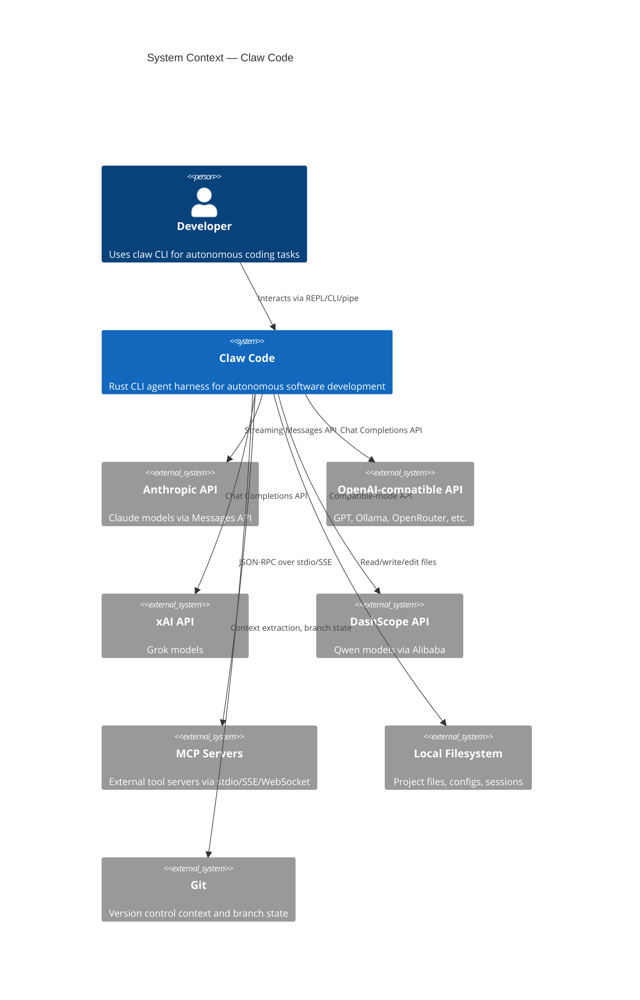

### 3.2 Container Diagram (C4 Level 2)

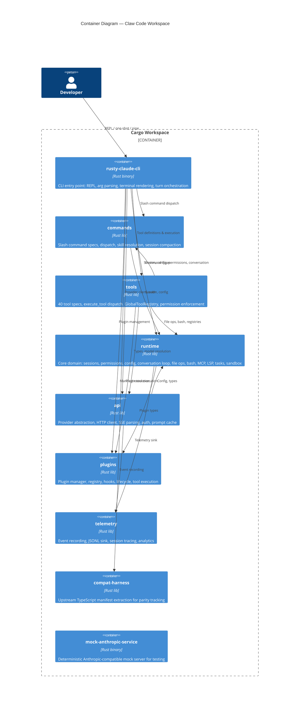

### 3.3 Component Diagram (C4 Level 3) — Runtime Crate

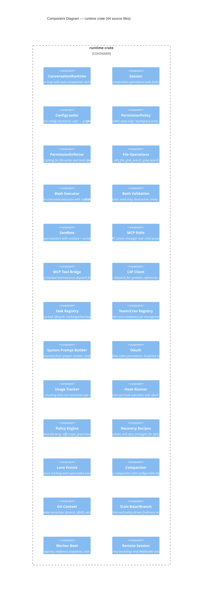

### 3.4 Crate Dependency Graph

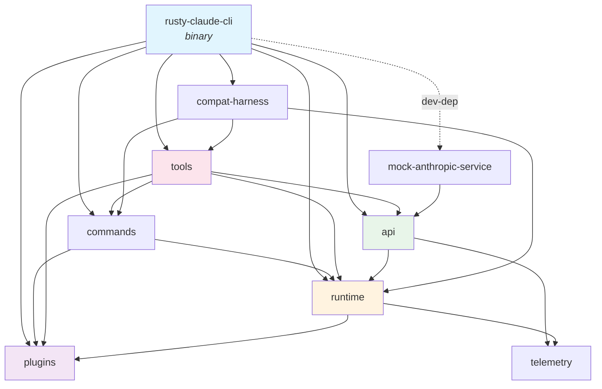

### 3.5 Data Flow — One-Shot Prompt Execution

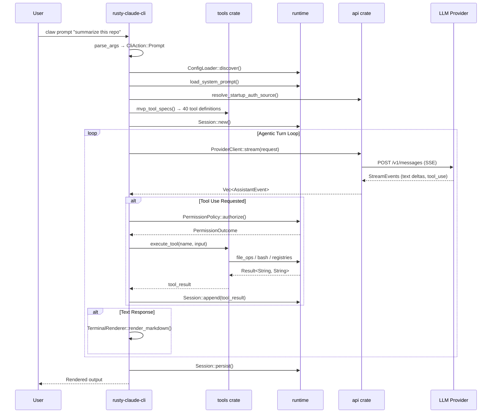

---

## 4. Core Architectural Components

### 4.1 `rusty-claude-cli` — CLI Binary

| Aspect | Detail |
|---|---|
| **Purpose** | Entry point for all user interaction: REPL, one-shot prompts, subcommands |
| **Binary name** | `claw` (or `claw.exe` on Windows) |
| **Key types** | `CliAction` (enum of 15 actions), `LiveCli`, `CliOutputFormat`, `LineEditor` |
| **Modules** | `main.rs` (arg parsing, turn execution, REPL), `init.rs` (project init), `input.rs` (rustyline integration), `render.rs` (Markdown→terminal) |

**Responsibilities:**
- Argument parsing (hand-rolled, no clap dependency)
- Model alias resolution with config-file user-defined aliases
- Interactive REPL with slash-command completion
- Streaming markdown rendering with syntax highlighting
- Progress spinner for long-running operations
- Session management (create, resume, export, compact)
- JSON and text output format support
- Piped stdin detection for non-interactive use

**Key Design Decisions:**
- No framework for CLI parsing — manual `parse_args` enables precise Claude Code compatibility
- The `LiveCli` struct orchestrates the full agentic loop: prompt → stream → tool dispatch → render
- `TerminalRenderer` uses `pulldown-cmark` + `syntect` for rich markdown output with code highlighting

### 4.2 `runtime` — Core Domain

| Aspect | Detail |
|---|---|
| **Purpose** | All core domain logic; the "engine" of Claw Code |
| **Size** | 44 source files, ~960 KB — largest crate by far |
| **Key dependencies** | `serde`, `serde_json`, `tokio`, `regex`, `sha2`, `glob`, `walkdir` |

The runtime crate is subdivided into clearly scoped modules:

#### Session Management (`session.rs`, `session_control.rs`)
- `Session` — append-only JSONL conversation log with message serialization
- `SessionStore` — filesystem-backed session discovery, creation, resume, and latest-session resolution
- `SessionFork` / `SessionCompaction` — branching and compaction of conversation histories
- `ConversationMessage` — typed message with role, content blocks, and metadata

#### Configuration (`config.rs`, `config_validate.rs`)
- `ConfigLoader::discover()` — 5-level merge: `~/.claw.json` → `~/.config/claw/settings.json` → `<repo>/.claw.json` → `<repo>/.claw/settings.json` → `<repo>/.claw/settings.local.json`
- `RuntimeConfig` — model aliases, permissions, features, hooks, MCP servers, plugins
- `ConfigDiagnostic` — validation with actionable diagnostics for malformed configs
- MCP server configuration: stdio, SSE, WebSocket, SDK, managed proxy, remote, OAuth

#### Permissions (`permissions.rs`, `permission_enforcer.rs`)
- `PermissionMode` — 5-variant enum: `ReadOnly`, `WorkspaceWrite`, `DangerFullAccess`, `Prompt`, `Allow`
- `PermissionPolicy` — stateful authorization engine with rule evaluation and prompter integration
- `PermissionEnforcer` — tool-specific gating: workspace boundary checks for file writes, read-only heuristics for bash
- `PermissionPrompter` — trait for interactive permission prompts (CLI implements this)

#### Conversation Loop (`conversation.rs`)
- `ConversationRuntime` — drives the agentic turn loop with auto-compaction
- `ApiClient` trait — minimal streaming contract: `fn stream(&mut self, request) -> Result<Vec<AssistantEvent>>`
- `ToolExecutor` trait — `fn execute(&mut self, tool_name, input) -> Result<String, ToolError>`
- `AssistantEvent` — streamed turn events: `TextDelta`, `ToolUse`, `Usage`, `PromptCache`, `MessageStop`
- Auto-compaction when input tokens exceed threshold (default 100K, configurable via env var)

#### File Operations (`file_ops.rs`)
- `read_file` — with binary detection (NUL byte), size limits (`MAX_READ_SIZE`), and line-range support
- `write_file` — workspace boundary validation, symlink escape prevention, size limits
- `edit_file` — structured patch application with hunk matching
- `glob_search` — pattern-based file discovery with `walkdir`
- `grep_search` — regex-powered content search with context lines and chunked output

#### Bash Execution (`bash.rs`, `bash_validation.rs`)
- `execute_bash` — `BashCommandInput` → `BashCommandOutput` with configurable timeout
- Sandbox integration via `build_linux_sandbox_command`
- 6 validation submodules: `readOnlyValidation`, `destructiveCommandWarning`, `modeValidation`, `sedValidation`, `pathValidation`, `commandSemantics`

#### MCP Protocol (`mcp_stdio.rs`, `mcp_client.rs`, `mcp.rs`, `mcp_tool_bridge.rs`, `mcp_server.rs`, `mcp_lifecycle_hardened.rs`)
- `McpServerManager` — lifecycle management for MCP stdio child processes
- `McpStdioProcess` — JSON-RPC 2.0 transport over stdin/stdout
- `McpToolRegistry` — registry bridge for tool listing, dispatch, resource reads, auth
- `McpLifecycleValidator` — degraded-mode reporting with phase-based health checks
- Supports stdio, SSE, WebSocket, SDK, managed proxy, and remote transports

#### LSP Client (`lsp_client.rs`)
- `LspRegistry` — dispatch for: diagnostics, hover, definition, references, completion, symbols, formatting
- Stateful server tracking per action + path

#### Task / Team / Cron Registries (`task_registry.rs`, `team_cron_registry.rs`)
- Thread-safe in-memory registries (`Mutex<HashMap<...>>`)
- `TaskRegistry` — create, get, list, stop, update, output, append_output, set_status, assign_team
- `TeamRegistry` — create, delete, list teams
- `CronRegistry` — create, delete, list scheduled jobs

#### Other Notable Modules
- `prompt.rs` — Dynamic system prompt assembly from project context, CLAUDE.md, date, git state
- `sandbox.rs` — Linux `unshare` namespace isolation with container environment detection
- `oauth.rs` — PKCE flow with S256 challenge, loopback redirect, token persistence
- `usage.rs` — Per-model pricing tables and cost estimation
- `compact.rs` — Session compaction with configurable thresholds
- `policy_engine.rs` — Rule-based lane blocking and green-level evaluation
- `recovery_recipes.rs` — Escalation policies and structured retry strategies
- `lane_events.rs` — Commit provenance tracking for multi-lane development
- `stale_base.rs` / `stale_branch.rs` — Drift detection and freshness enforcement
- `worker_boot.rs` — Worker registry, readiness snapshots, and task receipts
- `git_context.rs` — Repository state extraction: branch, HEAD, recent commits
- `remote.rs` — Upstream proxy bootstrap and WebSocket session context

### 4.3 `api` — Provider Abstraction

| Aspect | Detail |
|---|---|
| **Purpose** | HTTP transport, multi-provider abstraction, SSE parsing, authentication |
| **Key types** | `AnthropicClient`, `OpenAiCompatClient`, `ProviderClient`, `ProviderKind`, `MessageRequest/Response` |

**Module structure:**
- `client.rs` — `ProviderClient` (auto-detecting wrapper), `AuthSource` (API key vs Bearer token), OAuth token resolution
- `providers/anthropic.rs` — Anthropic Messages API implementation with SSE streaming, retry logic, beta headers
- `providers/openai_compat.rs` — OpenAI-compatible Chat Completions adapter (covers OpenRouter, Ollama, xAI, DashScope)
- `providers/mod.rs` — `detect_provider_kind()` routing, `resolve_model_alias()`, max token lookups
- `http_client.rs` — `reqwest` client builder with proxy support (`HTTP_PROXY`, `HTTPS_PROXY`, `NO_PROXY`, `proxy_url`)
- `types.rs` — Shared wire types: `MessageRequest`, `MessageResponse`, `InputMessage`, `OutputContentBlock`, `StreamEvent`, `ToolDefinition`, `ToolChoice`, `Usage`
- `sse.rs` — Incremental SSE frame parser for streaming responses
- `prompt_cache.rs` — Prompt cache tracking with break detection and stats
- `error.rs` — `ApiError` with structured error variants

**Provider detection logic:**
1. Model starts with `claude` → Anthropic
2. Model starts with `grok` → xAI
3. Model starts with `openai/`, `gpt-`, `qwen/`, `qwen-` → OpenAI-compatible
4. Fallback: check env vars `ANTHROPIC_API_KEY` → `OPENAI_API_KEY` → `XAI_API_KEY` → `DASHSCOPE_API_KEY`

### 4.4 `tools` — Tool Surface

| Aspect | Detail |
|---|---|
| **Purpose** | 40 tool definitions, dispatch logic, permission enforcement, tool search |
| **Key types** | `ToolSpec`, `GlobalToolRegistry`, `RuntimeToolDefinition`, `ToolSearchOutput` |

**40 exposed tool specs via `mvp_tool_specs()`:**

| Category | Tools |
|---|---|
| **File** | `read_file`, `write_file`, `edit_file`, `glob_search`, `grep_search` |
| **Execution** | `bash`, `PowerShell`, `REPL` |
| **Web** | `WebFetch`, `WebSearch` |
| **Task management** | `TaskCreate`, `TaskGet`, `TaskList`, `TaskStop`, `TaskUpdate`, `TaskOutput` |
| **Team/Cron** | `TeamCreate`, `TeamDelete`, `CronCreate`, `CronDelete`, `CronList` |
| **MCP** | `MCP`, `ListMcpResources`, `ReadMcpResource`, `McpAuth` |
| **LSP** | `LSP` |
| **Communication** | `AskUserQuestion`, `SendUserMessage`, `RemoteTrigger` |
| **Session** | `TodoWrite`, `NotebookEdit`, `Sleep`, `Config`, `Skill`, `Agent`, `ToolSearch` |
| **Mode** | `EnterPlanMode`, `ExitPlanMode`, `StructuredOutput`, `Brief` |
| **Lane** | `LaneCommit`, `LaneBlock`, `LaneReview`, `LaneStop`, `LaneSwitch` |
| **Worker** | `WorkerReady`, `WorkerDone`, `WorkerFailed` |

**Dispatch pattern:**
- `execute_tool(name, input)` matches on tool name and delegates to runtime functions
- `GlobalToolRegistry` merges builtin + plugin + runtime tools with conflict detection
- Optional `PermissionEnforcer` wraps execution with authorization checks
- Global singleton registries (`OnceLock`) for task, team, cron, MCP, LSP, and worker state

### 4.5 `commands` — Slash Commands

| Aspect | Detail |
|---|---|
| **Purpose** | REPL slash-command definitions and dispatch |
| **Key types** | `SlashCommandSpec`, `CommandRegistry`, `SkillSlashDispatch` |

**Supported slash commands:**
`/help`, `/status`, `/sandbox`, `/compact`, `/model`, `/permissions`, `/cost`, `/config`, `/session`, `/export`, `/diff`, `/doctor`, `/agents`, `/mcp`, `/skills`, `/plugin`, `/init`, `/review`

Each spec includes: name, aliases, summary, argument hint, and resume-support flag.

### 4.6 `plugins` — Extension System

| Aspect | Detail |
|---|---|
| **Purpose** | Third-party tool, hook, and command installation and lifecycle |
| **Key types** | `PluginManager`, `PluginRegistry`, `PluginTool`, `HookRunner`, `PluginManifest` |

**Plugin types:** Builtin, Bundled, External  
**Plugin capabilities:** Tools (with process execution), Hooks (pre/post tool use), Commands, Lifecycle scripts  
**Installation sources:** Local path, Git URL  
**Hook system:** `PreToolUse` (can deny), `PostToolUse`, `PostToolUseFailure` — executed as shell commands with JSON payload on stdin and env vars  

### 4.7 `telemetry` — Observability

| Aspect | Detail |
|---|---|
| **Purpose** | Structured event recording for HTTP requests, analytics, and session traces |
| **Key types** | `TelemetrySink` (trait), `MemoryTelemetrySink`, `JsonlTelemetrySink`, `SessionTracer` |

**Event types:** `HttpRequestStarted`, `HttpRequestSucceeded`, `HttpRequestFailed`, `Analytics`, `SessionTrace`  
**Design:** Sink-based architecture — any `TelemetrySink` impl can capture events; `JsonlTelemetrySink` persists to append-only log files.

### 4.8 `compat-harness` — Upstream Parity

| Aspect | Detail |
|---|---|
| **Purpose** | Extract command, tool, and bootstrap manifests from the upstream TypeScript source |
| **Key types** | `UpstreamPaths`, `ExtractedManifest`, `BootstrapPlan` |

Parses `src/commands.ts`, `src/tools.ts`, and `src/entrypoints/cli.tsx` to build registries for parity comparison. Detects bootstrap phases (CLI entry, fast paths, daemon, bridge, main runtime).

### 4.9 `mock-anthropic-service` — Test Infrastructure

| Aspect | Detail |
|---|---|
| **Purpose** | Deterministic Anthropic-compatible mock server for integration testing |
| **Key types** | `MockAnthropicService`, `CapturedRequest`, `Scenario` |

**10 scripted scenarios:** `streaming_text`, `read_file_roundtrip`, `grep_chunk_assembly`, `write_file_allowed`, `write_file_denied`, `multi_tool_turn_roundtrip`, `bash_stdout_roundtrip`, `bash_permission_prompt_approved`, `bash_permission_prompt_denied`, `plugin_tool_roundtrip`

Scenario selection is driven by a `PARITY_SCENARIO:` prefix in the first user message. Supports both streaming SSE and non-streaming responses.

---

## 5. Architectural Layers and Dependencies

### Layer Structure

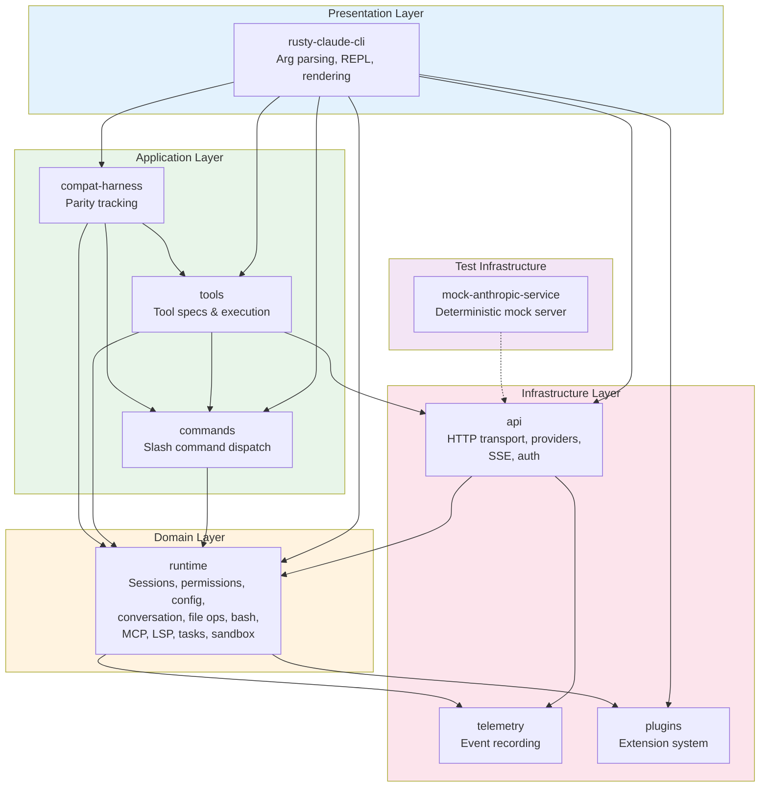

### Dependency Rules

1. **Presentation → Application → Domain** — strict downward flow
2. **Infrastructure ← Domain** — `api` depends on `runtime` for config types (slight inversion for pragmatic reuse)
3. **No circular dependencies** — verified by Cargo resolver
4. **Test infrastructure** — `mock-anthropic-service` is only a dev-dependency of `rusty-claude-cli`

### Notable Dependency Inversion

The `api` crate depends on `runtime` for shared types (`ConfigLoader`, etc.). This is a pragmatic trade-off — rather than extracting a separate `types` crate, commonly-needed types live in `runtime` and are imported by `api`. This creates a slight layer inversion (infrastructure → domain) but avoids crate proliferation.

---

## 6. Data Architecture

### 6.1 Domain Model

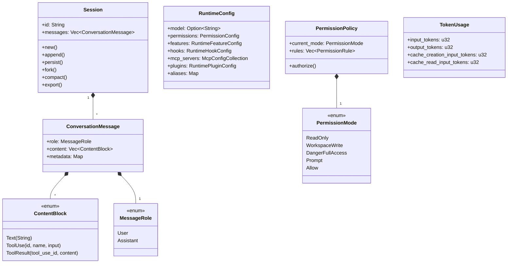

### 6.2 Session Persistence

Sessions are stored as **JSONL files** under `.claw/sessions/` in the workspace root:

```
.claw/
  sessions/
    <session-id>.jsonl      # Primary format — one JSON object per line
    <session-id>.json       # Legacy format (still readable)
```

Each line in a JSONL session file is a serialized `ConversationMessage`. This append-only format enables:
- Fast writes (no full-file rewrite)
- Safe concurrent reads
- Simple compaction (write a new file with summarized history)
- Session forking (copy + append)

### 6.3 Configuration Sources

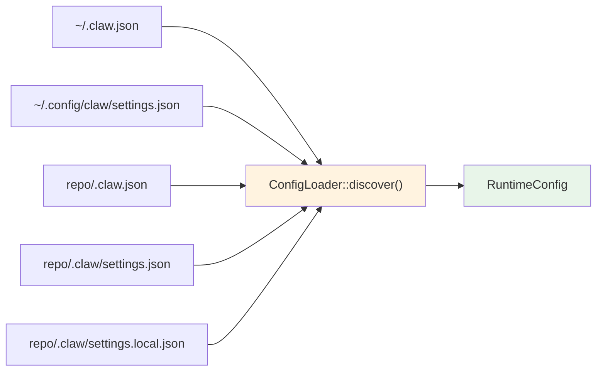

**Merge precedence:** Later sources override earlier ones. `.claw/settings.local.json` is git-ignored for machine-specific overrides.

### 6.4 Data Validation Patterns

- **File operations:** Binary detection (NUL byte scan), size limits, canonical path resolution, workspace boundary enforcement, symlink escape prevention
- **Config validation:** Schema-based diagnostics with actionable error messages and unsupported-format detection
- **Task packets:** `validate_packet()` with structured `TaskPacketValidationError`
- **Bash input:** 6-submodule validation pipeline for command safety

---

## 7. Cross-Cutting Concerns

### 7.1 Authentication & Authorization

**Authentication:**
- `ANTHROPIC_API_KEY` → `x-api-key` header (Anthropic direct)
- `ANTHROPIC_AUTH_TOKEN` → `Authorization: Bearer` header (OAuth/proxy)
- `OPENAI_API_KEY` → `Authorization: Bearer` header (OpenAI-compat)
- `XAI_API_KEY` → `Authorization: Bearer` header (xAI)
- `DASHSCOPE_API_KEY` → `Authorization: Bearer` header (Alibaba)
- OAuth PKCE flow with S256 challenge for interactive auth
- Mismatched credential detection with actionable error hints

**Authorization (Permission System):**

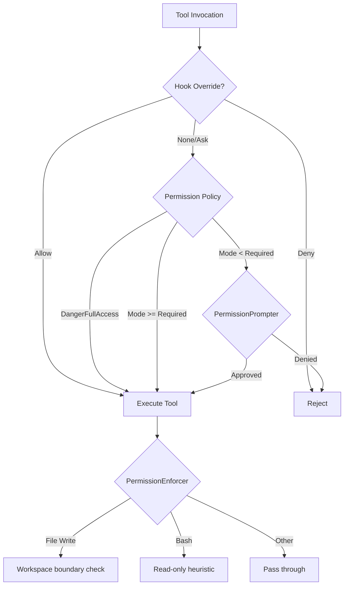

### 7.2 Error Handling & Resilience

**Error types:**
- `RuntimeError` — conversation-level failures (API errors, turn failures)
- `ToolError` — local tool execution failures
- `ApiError` — structured HTTP/provider errors with retry hints
- `PluginError` — plugin lifecycle and execution errors
- `ConfigError` — configuration parsing and validation errors
- `SessionError` — session I/O failures

**Resilience patterns:**
- `RecoveryRecipes` — structured retry strategies with escalation policies per `FailureScenario`
- SSE stream reconnection with incremental parsing
- Graceful fallback for proxy URL parse failures
- Broken-pipe tolerance in hook stdin writes (cross-platform race condition handling)
- `McpLifecycleValidator` — degraded-mode detection with phase-based health reporting

### 7.3 Logging & Monitoring

**Telemetry pipeline:**
- `TelemetrySink` trait with `record(TelemetryEvent)` method
- `JsonlTelemetrySink` — append-only JSONL file (production)
- `MemoryTelemetrySink` — in-memory vec (testing)
- `SessionTracer` — correlates events to sessions with monotonic sequence numbers
- HTTP request lifecycle tracking (started/succeeded/failed with attributes)
- Analytics events with namespace/action/properties
- Session trace records with timestamps

### 7.4 Validation

**Input validation:**
- Bash commands: 6-submodule validation pipeline (`readOnlyValidation`, `destructiveCommandWarning`, `modeValidation`, `sedValidation`, `pathValidation`, `commandSemantics`)
- File paths: canonical resolution, workspace boundary enforcement, symlink escape detection
- Config files: schema-based validation with diagnostic reporting
- Task packets: structured validation with typed errors
- Tool names: normalization and conflict detection in `GlobalToolRegistry`
- Model names: alias resolution through built-in + user-defined alias tables

### 7.5 Configuration Management

- 5-level config merge (user → project → local) with later sources overriding earlier ones
- Environment variable overrides: `ANTHROPIC_API_KEY`, `OPENAI_BASE_URL`, `HTTP_PROXY`, etc.
- Feature flags via `RuntimeFeatureConfig`
- MCP server configuration per transport type
- Plugin configuration with enable/disable state
- User-defined model aliases
- Permission rules per tool name

---

## 8. Service Communication Patterns

### 8.1 LLM Provider Communication

**Protocol:** HTTP/HTTPS with Server-Sent Events (SSE) for streaming  
**Pattern:** Request-response with streaming response body

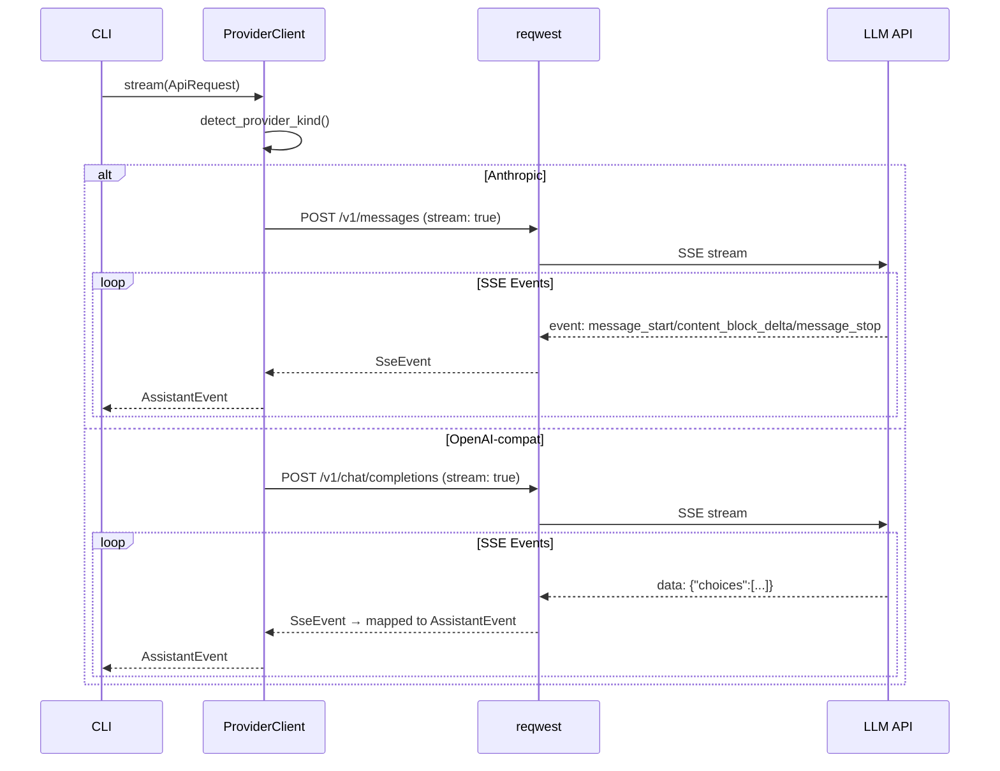

### 8.2 MCP Protocol Communication

**Protocol:** JSON-RPC 2.0 over stdio / SSE / WebSocket  
**Pattern:** Request-response over child process stdio

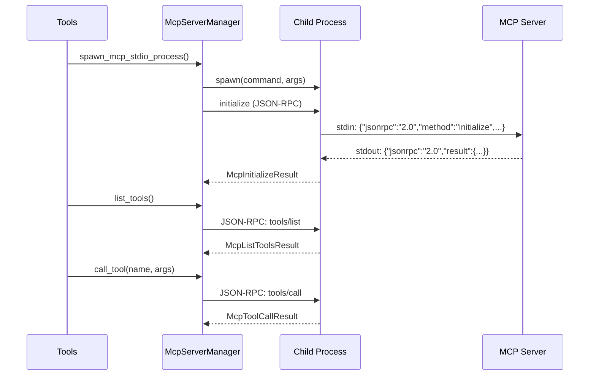

### 8.3 Plugin Hook Communication

**Protocol:** Shell subprocess with stdin JSON + environment variables  
**Pattern:** Pipeline with short-circuit on deny

```
HOOK_EVENT=PreToolUse
HOOK_TOOL_NAME=bash
HOOK_TOOL_INPUT={"command":"rm -rf /"}
HOOK_TOOL_IS_ERROR=0
stdin: {"hook_event_name":"PreToolUse","tool_name":"bash",...}

Exit code 0 → Allow
Exit code 2 → Deny (short-circuit)
Other       → Failed (short-circuit)
```

---

## 9. Rust Architectural Patterns

### 9.1 Crate Organization

The workspace uses a **`crates/*`** flat layout under `rust/`:

```
rust/
  Cargo.toml           # Workspace definition
  Cargo.lock           # Reproducible builds
  crates/
    api/               # HTTP/provider layer
    commands/          # Slash command specs
    compat-harness/    # Upstream parity extraction
    mock-anthropic-service/  # Test mock server
    plugins/           # Extension system
    runtime/           # Core domain (44 files)
    rusty-claude-cli/  # CLI binary
    telemetry/         # Observability
    tools/             # Tool surface
```

**Workspace-level settings:**
- `resolver = "2"` for modern feature resolution
- Shared version, edition (2021), license (MIT), `publish = false`
- `unsafe_code = "forbid"` — no unsafe code anywhere
- `clippy::all` + `clippy::pedantic` as warnings (with select allowances)

### 9.2 Memory and Performance Patterns

- **Thread-safe singletons** — Global registries use `OnceLock` + `Mutex<HashMap>` for lazy, thread-safe initialization:
  ```rust
  fn global_task_registry() -> &'static TaskRegistry {
      use std::sync::OnceLock;
      static REGISTRY: OnceLock<TaskRegistry> = OnceLock::new();
      REGISTRY.get_or_init(TaskRegistry::new)
  }
  ```

- **Zero-copy where possible** — `Cow<'_, str>` in highlighter, `&[u8]` for binary detection, `&str` returns for static data

- **Streaming processing** — SSE events are parsed incrementally; markdown is rendered event-by-event; file content is read with size limits rather than unbounded allocation

- **Arc-based sharing** — `Arc<Mutex<...>>` for shared mutable state (MCP request captures, telemetry sinks), `Arc<dyn TelemetrySink>` for trait-object sharing

- **`#[must_use]`** — Extensively applied to constructors and pure functions to prevent silent value drops

### 9.3 Asynchronous Programming

- **Tokio runtime** — `tokio::main(flavor = "multi_thread")` for the mock service; `rt-multi-thread` feature for API streaming in the CLI
- **Async/sync boundary** — The CLI's main loop is synchronous; async Tokio runtime is used internally for HTTP streaming and MCP I/O
- **Process I/O** — `tokio::process::Command` for async subprocess management in MCP; `std::process::Command` for synchronous bash/hook execution

### 9.4 Trait-Based Abstractions

Key traits that enable testability and extensibility:

| Trait | Purpose | Implementors |
|---|---|---|
| `ApiClient` | Streaming model API | `LiveCli` wrapper, test mocks |
| `ToolExecutor` | Tool dispatch | `StaticToolExecutor`, CLI-integrated executor |
| `PermissionPrompter` | Interactive permission UI | `CliPermissionPrompter`, test stubs |
| `TelemetrySink` | Event recording | `JsonlTelemetrySink`, `MemoryTelemetrySink` |
| `ToolCallHandler` | MCP server tool dispatch | Custom MCP handlers |

### 9.5 Error Handling Patterns

- **`Result<T, Box<dyn std::error::Error>>`** — used at the CLI boundary for maximum flexibility
- **Domain-specific error types** — `RuntimeError`, `ToolError`, `ApiError`, `PluginError`, `ConfigError`, `SessionError` with `Display` + `Error` impls
- **`Result<T, String>`** — used extensively at the tool dispatch level for simplicity
- **`unwrap_or_else`** — preferred over `unwrap()` with meaningful fallbacks
- **Poison recovery** — `PoisonError::into_inner` used consistently for mutex lock recovery

---

## 10. Implementation Patterns

### 10.1 Interface Design Patterns

**Builder pattern** — Used for complex config objects:
```rust
AnthropicRequestProfile::new(ClientIdentity::new("claude-code", "1.2.3"))
    .with_beta("tools-2026-04-01")
    .with_extra_body("metadata", json!({"source": "test"}))
```

**Newtype pattern** — Strong typing for domain concepts:
```rust
pub struct ToolError { message: String }
pub struct RuntimeError { message: String }
```

**Enum dispatch** — Central pattern for tool execution, CLI actions, and events:
```rust
enum CliAction {
    Prompt { ... },
    Repl { ... },
    Doctor { ... },
    // 12 more variants
}
```

### 10.2 Service Implementation Patterns

**Global singleton registries:**
```rust
fn global_task_registry() -> &'static TaskRegistry {
    use std::sync::OnceLock;
    static REGISTRY: OnceLock<TaskRegistry> = OnceLock::new();
    REGISTRY.get_or_init(TaskRegistry::new)
}
```

**Tool dispatch via match:**
```rust
pub fn execute_tool(tool_name: &str, input: &Value) -> Result<String, String> {
    match tool_name {
        "bash" => { /* delegate to runtime::execute_bash */ }
        "read_file" => { /* delegate to runtime::read_file */ }
        "write_file" => { /* delegate to runtime::write_file */ }
        // ...40 tool branches
    }
}
```

### 10.3 Configuration Resolution

**Multi-source merge with precedence:**
```rust
impl ConfigLoader {
    pub fn discover() -> Result<RuntimeConfig, ConfigError> {
        // 1. ~/.claw.json
        // 2. ~/.config/claw/settings.json
        // 3. <repo>/.claw.json
        // 4. <repo>/.claw/settings.json
        // 5. <repo>/.claw/settings.local.json
        // Later sources override earlier ones
    }
}
```

### 10.4 Permission Enforcement

**Layered authorization:**
1. Hook-provided overrides (allow/deny/ask)
2. Permission policy evaluation (mode comparison)
3. Interactive prompter for escalation
4. Tool-specific enforcer (workspace boundaries, read-only heuristics)

### 10.5 Domain Model Implementation

**Append-only session:**
```rust
impl Session {
    pub fn append(&mut self, message: ConversationMessage) { ... }
    pub fn persist(&self) -> Result<(), SessionError> {
        // Write each new message as a JSONL line
    }
    pub fn fork(&self) -> SessionFork { ... }
    pub fn compact(&self, config: &CompactionConfig) -> CompactionResult { ... }
}
```

**Content blocks as enum:**
```rust
pub enum ContentBlock {
    Text(String),
    ToolUse { id: String, name: String, input: String },
    ToolResult { tool_use_id: String, content: Vec<ToolResultContentBlock> },
}
```

---

## 11. Testing Architecture

### 11.1 Testing Strategy

| Level | Approach | Location |
|---|---|---|
| **Unit tests** | In-module `#[cfg(test)] mod tests` | Throughout all crates |
| **Integration tests** | Mock parity harness | `rusty-claude-cli/tests/mock_parity_harness.rs` |
| **Parity tests** | Behavioral diff against upstream | `rust/scripts/run_mock_parity_diff.py` |
| **Manual testing** | `claw doctor` health check | Runtime CLI command |

### 11.2 Mock Parity Harness

The `mock-anthropic-service` provides a **deterministic Anthropic-compatible mock server** that:
- Listens on `127.0.0.1:0` (OS-assigned port)
- Routes requests to scenarios based on `PARITY_SCENARIO:` prefix in user messages
- Captures all requests for assertion
- Supports both streaming (SSE) and non-streaming responses
- 10 scenarios covering: streaming text, file operations, bash execution, permission prompts, multi-tool turns, and plugin tools

### 11.3 Test Infrastructure

- **Temp directory isolation** — Tests create unique temp dirs with nanosecond timestamps to avoid collisions
- **Environment isolation** — `plugins::test_isolation::EnvLock` serializes tests that modify `HOME`/`XDG_*` env vars
- **Mutex-based test serialization** — `runtime::test_env_lock()` prevents parallel test interference
- **No `#[ignore]` tests** — Verified by grep; all tests must pass on every run

### 11.4 Verification Commands

```bash
cd rust
cargo fmt --all --check    # Format verification
cargo clippy --workspace --all-targets -- -D warnings  # Lint
cargo test --workspace     # Full test suite
```

---

## 12. Deployment Architecture

### 12.1 Build & Distribution

- **Build-from-source only** — No published crate, no binary distribution
- **Binary:** `rust/target/debug/claw` (debug) or `rust/target/release/claw` (release)
- **Cross-platform:** Linux, macOS, Windows (PowerShell-native)

### 12.2 Container Support

A `Containerfile` is provided for container-first workflows:
```
Containerfile  → Container image with Rust toolchain
```
Documentation in `docs/container.md`.

### 12.3 Runtime Configuration

```
~/.claw.json                          # User-level config
~/.config/claw/settings.json          # XDG config
<repo>/.claw.json                     # Project config
<repo>/.claw/settings.json            # Project settings
<repo>/.claw/settings.local.json      # Machine-local (git-ignored)
<repo>/.claw/sessions/                # Session persistence (git-ignored)
```

### 12.4 Environment Variables

| Variable | Purpose |
|---|---|
| `ANTHROPIC_API_KEY` | Anthropic API key |
| `ANTHROPIC_AUTH_TOKEN` | OAuth/proxy bearer token |
| `ANTHROPIC_BASE_URL` | Custom Anthropic endpoint |
| `OPENAI_API_KEY` | OpenAI-compatible key |
| `OPENAI_BASE_URL` | OpenAI-compatible endpoint |
| `XAI_API_KEY` | xAI API key |
| `DASHSCOPE_API_KEY` | Alibaba DashScope key |
| `HTTP_PROXY` / `HTTPS_PROXY` | Proxy configuration |
| `NO_PROXY` | Proxy bypass list |
| `CLAUDE_CODE_AUTO_COMPACT_INPUT_TOKENS` | Compaction threshold |
| `CLAUDE_CODE_UPSTREAM` | Upstream repo path for parity |
| `CODEX_HOME` | Legacy skill/command lookup root |

### 12.5 Sandbox Isolation (Linux)

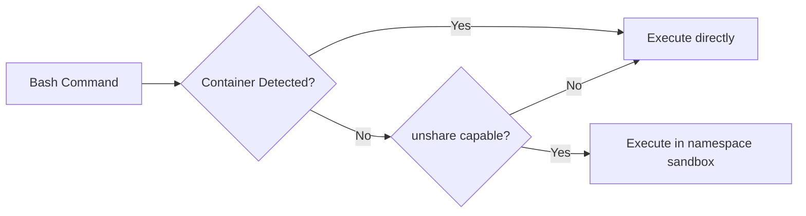

- Linux `unshare` for namespace isolation (PID, mount, network)
- Container environment detection (Docker, Podman, LXC, systemd-nspawn)
- Fallback to direct execution when sandboxing is unavailable

---

## 13. Extension and Evolution Patterns

### 13.1 Feature Addition Patterns

**Adding a new tool:**
1. Define `ToolSpec` in `tools/src/lib.rs` → `mvp_tool_specs()`
2. Add match arm in `execute_tool()` or `execute_tool_with_enforcer()`
3. Implement execution logic in `runtime` (if domain logic needed) or directly in `tools`
4. Set `required_permission` appropriately
5. Add test scenario in `mock-anthropic-service` if the tool involves API interaction

**Adding a new slash command:**
1. Add `SlashCommandSpec` to `SLASH_COMMAND_SPECS` in `commands/src/lib.rs`
2. Implement handler function
3. Wire into CLI dispatch in `main.rs`

**Adding a new provider:**
1. Create module in `api/src/providers/`
2. Implement streaming message conversion to `AssistantEvent`
3. Add detection logic in `detect_provider_kind()`
4. Register in `ProviderClient` dispatch

### 13.2 Plugin Extension Points

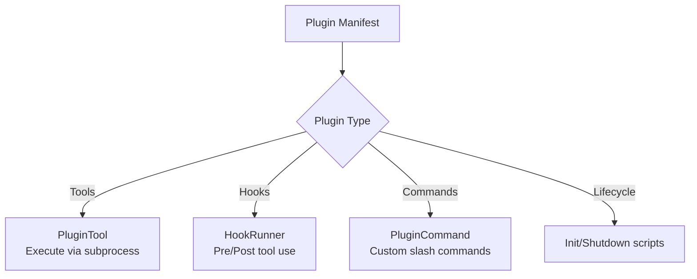

**Plugin installation flow:**
1. `PluginManager::install(source)` — clone/copy plugin source
2. Parse `.claude-plugin/plugin.json` manifest
3. Register in `installed.json`
4. Build `PluginRegistry` from all installed plugins
5. Aggregate hooks, tools, and commands

### 13.3 MCP Server Integration

New MCP servers can be added via configuration:
```json
{
  "mcpServers": {
    "my-server": {
      "command": "node",
      "args": ["server.js"],
      "transport": "stdio"
    }
  }
}
```

Supported transports: stdio, SSE, WebSocket, SDK, managed proxy, remote.

### 13.4 Modification Safety Patterns

- **Config merge precedence** — `.claw/settings.local.json` overrides without modifying shared files
- **Session forking** — Branching conversations without mutating the original
- **Permission escalation** — Interactive prompts before destructive operations
- **Workspace boundary enforcement** — Prevents writes outside the project root

---

## 14. Architectural Pattern Examples

### 14.1 Layer Separation — Tool Execution

**Interface definition (`runtime/conversation.rs`):**
```rust
pub trait ToolExecutor {
    fn execute(&mut self, tool_name: &str, input: &str) -> Result<String, ToolError>;
}
```

**Implementation in `tools` crate dispatches to `runtime` functions:**
```rust
pub fn execute_tool(tool_name: &str, input: &Value) -> Result<String, String> {
    match tool_name {
        "read_file" => {
            let path = input["file_path"].as_str().unwrap_or_default();
            let output = runtime::read_file(path, ...)?;
            Ok(serde_json::to_string(&output).unwrap())
        }
        "bash" => {
            let command = input["command"].as_str().unwrap_or_default();
            let output = runtime::execute_bash(BashCommandInput { command, ... })?;
            Ok(output.stdout)
        }
        // ...
    }
}
```

### 14.2 Provider Abstraction

**Unified client interface:**
```rust
pub struct ProviderClient { /* auto-detecting wrapper */ }

impl ProviderClient {
    pub fn stream(&mut self, request: ApiRequest) -> Result<Vec<AssistantEvent>, RuntimeError> {
        match self.kind {
            ProviderKind::Anthropic => self.anthropic.stream(request),
            ProviderKind::OpenAiCompat => self.openai.stream(request),
            ProviderKind::Xai => self.xai.stream(request),
        }
    }
}
```

**Provider detection:**
```rust
pub fn detect_provider_kind(model: &str) -> ProviderKind {
    if model.starts_with("claude") { ProviderKind::Anthropic }
    else if model.starts_with("grok") { ProviderKind::Xai }
    else if model.starts_with("openai/") || model.starts_with("gpt-") { ProviderKind::OpenAiCompat }
    else { /* check env vars for ambient credentials */ }
}
```

### 14.3 Permission Enforcement Chain

```rust
fn execute_tool_with_enforcer(
    enforcer: Option<&PermissionEnforcer>,
    name: &str,
    input: &Value,
) -> Result<String, String> {
    if let Some(enforcer) = enforcer {
        match enforcer.check(name, input) {
            EnforcementResult::Allowed => {}
            EnforcementResult::Denied(reason) => return Err(reason),
        }
    }
    execute_tool(name, input)
}
```

### 14.4 Hook Execution Pipeline

```rust
impl HookRunner {
    pub fn run_pre_tool_use(&self, tool_name: &str, tool_input: &str) -> HookRunResult {
        for command in &self.hooks.pre_tool_use {
            match Self::run_command(command, ...) {
                HookCommandOutcome::Allow { message } => { /* continue */ }
                HookCommandOutcome::Deny { message } => return HookRunResult::denied(message),
                HookCommandOutcome::Failed { message } => return HookRunResult::failed(message),
            }
        }
        HookRunResult::allow(messages)
    }
}
```

### 14.5 Singleton Registry Pattern

```rust
// Thread-safe lazy initialization — used for all global registries
fn global_task_registry() -> &'static TaskRegistry {
    use std::sync::OnceLock;
    static REGISTRY: OnceLock<TaskRegistry> = OnceLock::new();
    REGISTRY.get_or_init(TaskRegistry::new)
}

// Registry internals use Mutex<HashMap> for thread-safe mutation
pub struct TaskRegistry {
    tasks: Mutex<HashMap<String, TaskRecord>>,
    next_id: AtomicU64,
}
```

---

## 15. Architectural Decision Records

### ADR-1: Rust as Implementation Language

**Context:** The original Claude Code implementation is in TypeScript. A Rust rewrite was chosen.  
**Decision:** Implement the CLI in Rust.  
**Rationale:**
- Single binary distribution (no Node.js runtime dependency)
- Memory safety without garbage collection pauses
- Superior startup time for CLI tools
- `unsafe_code = "forbid"` for security confidence
- Cargo workspace for clean crate boundaries  
**Consequences:** (+) Fast, safe, portable binary. (−) Steeper contributor learning curve; async/sync boundary management required.

### ADR-2: Cargo Workspace with 9 Crates

**Context:** The runtime grew beyond a single crate's manageable complexity.  
**Decision:** Split into 9 focused crates with explicit dependency boundaries.  
**Rationale:**
- Compile-time enforcement of architectural boundaries
- Parallel compilation of independent crates
- Clear ownership: `runtime` = domain, `api` = transport, `tools` = dispatch  
**Consequences:** (+) Enforced layering, faster incremental builds. (−) Some type-sharing awkwardness (`api` depends on `runtime`).

### ADR-3: No `unsafe` Code

**Context:** A coding agent that modifies user files needs maximum safety guarantees.  
**Decision:** `unsafe_code = "forbid"` at workspace level.  
**Rationale:** The tool modifies filesystems and executes commands — any memory unsafety could have catastrophic consequences.  
**Consequences:** (+) Eliminates UB risk entirely. (−) Cannot use some performance optimizations; must use `Mutex` instead of atomics for complex shared state.

### ADR-4: Multi-Provider Architecture

**Context:** Users need flexibility beyond just Anthropic.  
**Decision:** Implement Anthropic + OpenAI-compatible + xAI + DashScope backends with automatic detection.  
**Rationale:**
- OpenAI-compatible is a de facto standard (covers Ollama, OpenRouter, vLLM)
- xAI/Grok is popular for cost-effective tasks
- DashScope provides high-rate-limit Qwen access
- Model-name prefix routing prevents misrouting  
**Consequences:** (+) Works with any major provider. (−) Feature matrix varies per provider; stream event mapping adds complexity.

### ADR-5: Plugin System with Subprocess Execution

**Context:** Extensibility without recompilation.  
**Decision:** Plugins execute tools and hooks as subprocesses with JSON on stdin and environment variables.  
**Rationale:**
- Language-agnostic (any executable works)
- Process isolation prevents plugin crashes from affecting the CLI
- Exit code conventions (0=allow, 2=deny) for hook control flow  
**Consequences:** (+) Maximum extensibility. (−) Process startup overhead; cross-platform shell behavior differences.

### ADR-6: JSONL Session Format

**Context:** Conversations can be very long and need crash-safe persistence.  
**Decision:** Use append-only JSONL files for session storage.  
**Rationale:**
- Append-only is crash-safe (no partial overwrites)
- Line-oriented format is easy to stream and compact
- Each line is independently parseable  
**Consequences:** (+) Robust persistence, simple compaction. (−) No random access; full scan needed for resume.

### ADR-7: Hand-Rolled Argument Parser

**Context:** CLI compatibility with the upstream Claude Code interface.  
**Decision:** Manual `parse_args()` instead of clap or structopt.  
**Rationale:**
- Exact behavioral compatibility with upstream flag handling
- Support for positional subcommands that double as prompt text
- `--resume` flag semantics require non-standard parsing  
**Consequences:** (+) Precise control over parsing behavior. (−) More code to maintain; no auto-generated help.

### ADR-8: Deterministic Mock Service for Testing

**Context:** Integration tests need reproducible API responses without network access.  
**Decision:** Build a dedicated `mock-anthropic-service` crate with scripted scenarios.  
**Rationale:**
- Reproducible test outcomes regardless of API availability
- Scenario-driven testing covers specific behavioral contracts
- Request capture enables assertion on what the CLI sent  
**Consequences:** (+) Fast, deterministic CI. (−) Scenarios must be manually maintained as the API surface evolves.

---

## 16. Architecture Governance

### 16.1 Automated Checks

- **`cargo fmt --all --check`** — Formatting consistency
- **`cargo clippy --workspace --all-targets -- -D warnings`** — Lint enforcement (pedantic level)
- **`cargo test --workspace`** — Full test suite
- **`unsafe_code = "forbid"`** — Compile-time unsafe prevention
- **No `#[ignore]` tests** — Verified by grep; all tests must pass

### 16.2 Parity Tracking

`PARITY.md` provides commit-level documentation of the Rust port status:
- 9-lane checkpoint with commit hashes and evidence
- Mock parity harness with 10 scripted scenarios
- Behavioral checklist runner (`rust/scripts/run_mock_parity_diff.py`)
- Explicit "still open" and "still limited" sections

### 16.3 Documentation Practices

| Document | Purpose |
|---|---|
| `CLAUDE.md` | AI assistant guidance for the repository |
| `PARITY.md` | Rust port status and migration notes |
| `ROADMAP.md` | Active roadmap and cleanup backlog |
| `PHILOSOPHY.md` | Project intent and system-design framing |
| `USAGE.md` | Task-oriented usage guide |
| `rust/README.md` | Crate map, CLI surface, workspace layout |
| `docs/container.md` | Container-first workflow |

---

## 17. Blueprint for New Development

### 17.1 Development Workflow

**Starting a new feature:**
1. Identify which crate(s) are affected
2. Add types/traits in `runtime` if new domain concepts are needed
3. Add tool specs in `tools` if new tools are exposed
4. Add slash commands in `commands` if new REPL commands are needed
5. Wire into CLI in `rusty-claude-cli` if new CLI actions are needed
6. Add mock scenarios in `mock-anthropic-service` if new API interactions are needed

**Verification loop:**
```bash
cd rust
cargo fmt --all
cargo clippy --workspace --all-targets -- -D warnings
cargo test --workspace
```

### 17.2 Implementation Templates

**New tool template:**
```rust
// In tools/src/lib.rs — add to mvp_tool_specs()
ToolSpec {
    name: "my_new_tool",
    description: "Does something useful",
    input_schema: json!({
        "type": "object",
        "properties": {
            "param": { "type": "string", "description": "A parameter" }
        },
        "required": ["param"]
    }),
    required_permission: PermissionMode::ReadOnly,
},

// In tools/src/lib.rs — add match arm in execute_tool()
"my_new_tool" => {
    let param = input["param"].as_str().unwrap_or_default();
    // delegate to runtime if complex domain logic is needed
    Ok(format!("result: {param}"))
}
```

**New runtime module template:**
```rust
// In runtime/src/my_module.rs
use std::sync::Mutex;
use std::collections::HashMap;

pub struct MyRegistry {
    items: Mutex<HashMap<String, MyRecord>>,
}

impl MyRegistry {
    #[must_use]
    pub fn new() -> Self {
        Self { items: Mutex::new(HashMap::new()) }
    }

    pub fn create(&self, name: &str) -> String {
        let mut items = self.items.lock()
            .unwrap_or_else(std::sync::PoisonError::into_inner);
        let id = format!("my-{}", items.len());
        items.insert(id.clone(), MyRecord { name: name.to_string() });
        id
    }
}

// In runtime/src/lib.rs — add module and re-exports
pub mod my_module;
pub use my_module::MyRegistry;
```

### 17.3 Common Pitfalls

1. **Don't add `unsafe` code** — `unsafe_code = "forbid"` is workspace-wide and intentional
2. **Don't skip permission enforcement** — Every tool that modifies state needs a `required_permission` in its `ToolSpec`
3. **Don't use `#[ignore]` on tests** — All tests must pass on every run (verified by CI grep)
4. **Don't break the dependency direction** — `runtime` must not depend on `tools`, `commands`, or `rusty-claude-cli`
5. **Don't forget Windows** — `#[cfg(windows)]` / `#[cfg(not(windows))]` branching is required for shell commands and path handling
6. **Don't use `unwrap()` without justification** — Prefer `unwrap_or_else`, `unwrap_or_default`, or explicit error propagation
7. **Don't modify `PARITY.md` automatically** — Update it intentionally when real parity milestones are reached
8. **Handle mutex poisoning** — Use `unwrap_or_else(PoisonError::into_inner)` consistently

### 17.4 Performance Considerations

- **File operations** have size limits (`MAX_READ_SIZE`, `MAX_WRITE_SIZE`) — respect them
- **Session persistence** is append-only — use compaction for long sessions
- **Global registries** use `OnceLock` — initialization is lazy and happens once
- **SSE parsing** is incremental — don't buffer entire responses
- **Bash execution** has configurable timeouts — always set appropriate limits

---

*This blueprint was generated on 2026-04-14T16:31:01.466Z by Claude Opus 4.6 from analysis of the claw-code repository at commit `f5a24d1`. It should be updated when significant architectural changes occur (new crates, changed dependency directions, new provider backends, or major feature additions).*
